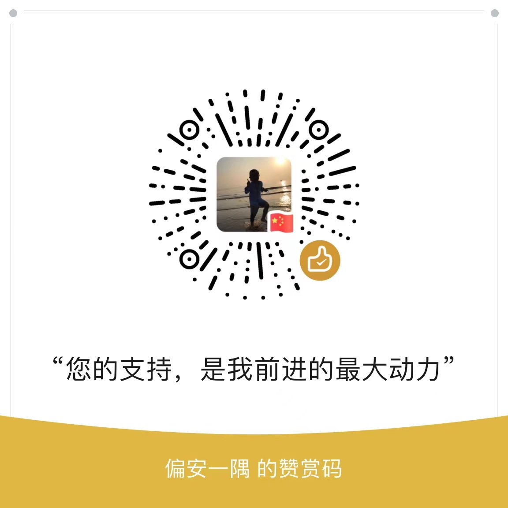

## tf-movenet-wechat

微信小程序运训TensorFlow MoveNet模型的Demo，兼容华为与小米机型， 华为与小米机型采用PoseNet模型， 其他采用MoveNet模型， 代码与小程序不定期更新。

## 使用方法
1. 克隆代码到本地
2. 修改 project.config.json 中的 appid 配置
3. 在小程序管理后台的“设置-第三方服务-插件管理”中，4. 通过 appid [wx6afed118d9e81df9] 查找并添加
5. npm i 安装依赖
6. npm run build 编译依赖
7. 手机扫描开发者工具的预览码

## 合作与交流
您的支持，是我前进的最大动力

